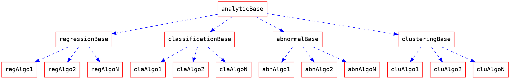

<style type="text/css">
.apiok{
color:#04B486
}
.apitesting{
color:#ff8900
}
.methodok{
color:#01A9DB
}
.extend{
color:#9370DB
}
.building{
color:#FCCF46
}
.scheduled{
color:#BDBDBD
}
</style>


InCore Ops Document
===
## About Document
<font class='apiok'>Tested API</font>
<font class='apitesting'>Untest API</font>
<font class='building'>Building API</font>
<font class='methodok'>Tested Method</font>
<font class='extend'>Extendable Method</font>
<font class='scheduled'>Scheduled</font>

## About Package
 ### Database
 &nbsp;&nbsp;&nbsp;&nbsp;&nbsp;
 
 ### Framework
 &nbsp;&nbsp;&nbsp;&nbsp;&nbsp;
 
 ### Data
 &nbsp;&nbsp;&nbsp;&nbsp;&nbsp;
 &nbsp;&nbsp;&nbsp;
 
 ### Visualize
 &nbsp;&nbsp;&nbsp;&nbsp;&nbsp;
 &nbsp;&nbsp;&nbsp;
 
 
 ### Analytic
 &nbsp;&nbsp;&nbsp;&nbsp;&nbsp;
 &nbsp;&nbsp;&nbsp;&nbsp;&nbsp;&nbsp;&nbsp;
 
 

## Run
- Under `incore` folder, run `python3 apps.py`

## About Token
When requesting a service, the request should contain a jwt token `token` to validate the request source.

**Contact DevOps for the audience in jwt.**

The validator is `tokenValidator` in `src/utils.py`

## Parameters setting
- file location: `src/params.py`
- Description: File folder, model folder, acceptable files, acceptable projects are defined in this file. 
- Usage: In each py
  - use `from params import params` to import
  - create instance `param=params()`
  - Then get var with `param.var`

## System variable API
- Folder location: `src/controller/getConfig.py`
- Description: get system settings

<details>
<summary class='apiok'>[API] getDataProject</summary>

- Description: Get supported project of one dataType
- ==**Usage**==: `GET http://host/sys/dataproject`

    ```
    {
        "status": Enum("success","error"),
        "msg": "error msg",
        "data": {
            "num": [
                "regression",
                "classification",
                "abnormal",
                "clustering"
            ],
            "cv": [
                "regression",
                "classification"
            ],
            "nlp": [
                "regression",
                "classification"
            ]
        }
    }
    ```
</details>

<details>
<summary class='apiok'>[API] getDataExtension</summary>

- Description: Get supported extension of one dataType
- ==**Usage**==: `GET http://host/sys/dataextension` with param
    ```
    {
        "datatype": Enum("num", "cv", "nlp")
    }
    ```
    
    and get response
    
    ```
    {
        "status": Enum("success", "error")
        "msg": "error msg",
        "data": {
            [
                ".ext1", ".ext2" ....
            ]
        }
    }
    ```
</details>

## Data collection service
- Folder location: `src/service/dataService`
- Description: this service contains **upload**, **download**, **getColumn**, **getFileStatus**, **delete** API


<details>
<summary class='apiok'>[API] dataUpload</summary>

- File location: `src/service/dataService/controller/upload.py`
- Description: This py is a upload API. When uploading a file, the service will check the file type and project type. Then generate a file UID. After that, the service will check the file content with checkers in `src/resources/dataService/fileChecker.py`.
- ==**Usage**==: `POST http://host/data/upload` with a form

    ```
    {
        "file": binaryFile,
        "type": "dataType ( num/cv/nlp)",
        "token": "token_string"
    }
    ```
    and get a response
    ```
    {
        "status": Enum("success", "error"),
        "msg": "error_msg",
        "data":{
            "fileUid": "the_generated_file_uid"
        }
    }
    ```
- Acceptable file types and their rules:
  - **Numerical project**: A `csv` with column name and their values. The values should be numerical data (classifiable text will be supported in v2.0). For example:
    ```
    temp,humidity,quantity
    30.57,43,6
    22.89,99,30
    ```
  - **NLP project**: A `tsv` with column name. For project with label, there should be at least one column  which contains the numerical value. For example:
    ```
    Sentence1	value	value2
    I am happy	1	1
    I am sad	0	0
    ```
    or
    ```
    Sentence1	Sentence2	value
    I am happy	So am I :)	1
    I am happy	I am a student	0
    ```
  - **CV project**: A `zip` file. There should be a (only one) `csv` file in the zip directly, not in a folder. For project with label, here should be at least one column that contains the numerical value. Other columns are the image file path (related path in zip). For example:
    ```
    file.zip
        |--lables.csv
        |--folder_foo
        |    |--imga.jpg
        |    |--imgb.png
        |
        |--folder_bar
        |    |--imgk.JPEG
        |    |--imgl.png
        |--imgt.jpg
    ```
    and the csv is
    ```
    filepath,value
    folder_foo/imga.jpg,1
    folder_foo/imgb.png,1
    folder_bar/imgk.JPEG,0
    folder_bar/imgl.png,0
    imgt.jpg,1
    ```
</details>


<details>
<summary class='apiok'>[API] dataDownload</summary>

- File location: `src/service/dataService/controller/download.py`
- Description: Download file
- ==**Usage**==: `GET http://host/data/download` with a form

    ```
    {
        "fileUid": "file_id"
    }
    ```
    and get a binary response

</details>


<details>
<summary class='apiok'>[API] dataDelete</summary>


- File location: `src/service/dataService/controller/delete.py`
- Description: Delete file
- ==**Usage**==: `POST http://host/data/delete` with a form

    ```
    {
        "fileUid": "file_id",
        "token": "token_string"
    }
    ```
    get a json
    ```
    {
        "status": Enum("success", "error"),
        "msg": "error_msg",
        "data":{}
    }
    ```
</details>


<details>
<summary class='apiok'>[API] getColumn</summary>

- File location: `src/service/dataService/controller/getColumn.py`
- Description: Get column names and types
- ==**Usage**==: `POST http://host/data/getcol` with a form

    ```
    {
        "fileUid": "file_id",
        "token": "token_string"
    }
    ```
    get a json
    ```
    {
        "status": Enum("success", "error"),
        "msg": "error_msg",
        "data":{
            "cols":[
                {
                    "name": "col1_name",
                    "type": Enum("int", "float", "path", "string"),
                    "classifiable": Enum(1,0)
                }
            ]
        }
    }
    ```
</details>

<details>
<summary class='apiok'>[API] getFileStatus</summary>

- File location: `src/service/dataService/controller/getFileStatus.py`
- Description: Get file (batch) status 
- ==**Usage**==: `POST http://host/data/getstatus` with a form

    ```
    {
        "fileUid":(a json list string) "["file_id1", "file_id2"]",
        "token": "token_string"
    }
    ```
    get a json
    ```
    {
        "status": Enum("success", "error"),
        "msg": "error_msg",
        "data":{
            "status":[Enum(0, 1), Enum(0, 1)]
        }
    }
    ```
    0 for not in-use, 1 for in-use
</details>


<details>
<summary class='methodok'>[Method] fileUidGenerator</summary>

- File location: `src/service/dataService/utils.py`
- Description: Generate unique file id
- Usage: 

    ```python
    from service.dataService.utils import fileUidGenerator
    uid=fileUidGenerator().uid
    ```

</details>

<details>
<summary class='methodok'>[Method] fileChecker</summary>

- File location: `src/service/dataService/utils.py`
- Description: Validate file content
- Usage: 

    ```python
    from service.dataService.utils import fileChecker
    fileCheck=fileChecker(savedPath,dataType).check()
    ```
</details>

<details>
<summary class='methodok'>[Method] getColType</summary>

- File location: `src/service/dataService/utils.py`
- Description: Get column names and type
- Usage: 

    ```python
    from service.dataService.utils import getColType
    coltype=getColType(savedPath,dataType).check()
    ```
    This is how `coltype` looks like:
    ```
    [
        {
            'name':col1_name,
            'type':col1_type Enum("int", "float", "string", "path"),
            'classifiable': Enum(1, 0)
        },
        {
            'name':col2_name,
            'type':col1_type Enum("int", "float", "string", "path"),
            'classifiable': Enum(1, 0)
        }...
    ]

    ```
</details>

<details>
<summary class='methodok'>[Method] getDf</summary>

- File location: `src/service/dataService/utils.py`
- Description: Get column names and type
- Usage: 

    ```python
    from service.dataService.utils import getColType
    data=getDf(savedPath,dataType).get()['data']
    ```
    
    Data is a dataframe.
</details>

## Visualize Service
- filelocation: `src/resources/visualizationService`
- Description: Use `bokeh` to show data and image. If the data is not supported by bokeh, it will return the image result of `matplotlib` and shown by bokeh.<br>For showing `bokeh` with `js`, please refer to _section 2_ of [this article](https://blog.csdn.net/cooldiok/article/details/85273652?fbclid=IwAR1fdXZ9k5FdqXq82sEWd3Lexe1vmiPr1ZDMad2Qvvv9xAakJWwozIWeRZo).

<details>
<summary class='apiok'> [API] getDataVizAlgoList</summary>

- File location: `src/service/visualizeService/controller/dataviz.py`
- Description: get data visualize algorithm
- ==**Usage**==: `GET http://host/viz/data/getalgo`

    get a json

    ```
    {
            "status": Enum("success", "error"),
            "msg": "error_msg",
            "data":{
                {
                    "algos":[
                        {
                            "friendlyname":"algoname1",
                            "lib":"used lib",
                            "algoname":"algo1",
                            "data":{
                                "x":"float", -> need a x col and must be float or int
                                "y":"string", -> need a y col and must be string
                                "value":"none" -> not needed
                            },
                            "description":"2D line plot" -> algo description
                        },
                        {
                            "friendlyname":"algoname2",
                            "lib":"used lib",
                            "algoname":"algo2",
                            "data":{
                                "x":"int", -> need a x col and must be int
                                "y":"path", -> need a y col and must be path
                                "value":"float" -> need a value col and must be float
                            },
                            "description":"2D scatter plot" -> algo description
                        }
                    ]
                }
            }
    }
    ```
</details>


<details>
<summary class='apiok'> [API] dataViz</summary>

- File location: `src/service/visualizeService/controller/dataViz.py`
- Description: Visualizing data
- ==**Usage**==: `POST http://host/viz/data/do` with param

    ```
    {
        "fileUid": "fileID",
        "algoname": "algoname",
        "datacol": (a json string) "{
            "x":"col_name1",
            "y":"col_name2",
            "value":"col_name3"
        }" 
        "token": "token_string"
    }
    ```
    
    and get a response
    
    ```
    {
        "status": Enum("success", "error"),
        "msg": "error_msg",
        "data":{
            "div": "div of bokeh",
            "script": "script of bokeh"
        }
    }
    ```
</details>

<details>
<summary class='apiok'> [API] getImg</summary>

- File location: `src/service/visualizeService/controller/getImg.py`
- Description: Get binary img
- ==**Usage**==: `GET http://host/viz/getimg` with param

    ```
    uid='imguid'
    action='get'/'download'
    ```
</details>

<details>
<summary class='extend'> [CORE] [EXTENDABLE] dataViz</summary>

- BaseClass File location: `src/service/visualizeService/core/dataViz.py`
</details>

## Analytic Service

### Preprocess and Data info

<details>
<summary class='methodok'> [CORE] missingFiltering</summary>

- File location: `src/service/analuticService/core/preprocess/missingFiltering.py`
- Discription: Filt missing value of number, string and path.
- ==**Usage**==: 
    - `filtCols` get a filted data
    
        Args: 
        - data: A 2D array of data
        - coltype: colType Enum("int", "float", "string", "path")
        - doList: filt the column or not
        - pathBase: the base folder of CV file. (OPTIONAL)
        ``` 
        filted_data=missingFitering().filtCols(
            [[dataCol1],[dataCol2]..],
            ["dataColType1","dataColType1"],
            [True,False],
            path_of_file (cv folder)
        )
        ```

        get a 2D array of filted data
    - `getRetainIndex` get which row to be retained
    
        Args:
        - data: A 2D array of data to check missing value
        - coltype: their colType
        - pathBase: the base folder of CV file. (OPTIONAL)
        ```
        retainIndex=missingFiltering().getRetainIndex(
            [[dataCol1],[dataCol2]..],
            ["dataColType1","dataColType1"],
            path_of_file (cv folder)
        )
        ```
        
        get a 1D np array of retain or not
</details>

<details>
<summary class='extend'> [CORE] [EXTENDABLE] normalize</summary>

- File location: `src/service/analuticService/core/preprocess/normalize.py`
- Discription: Normalize the column
- ==**Usage**==: 
    
    Call imeplemented algo class, `do` to normalize
    
    Args: 
    - data: A 1D array of data
    
    ``` 
    data=normalizeAlgo(data).do()
    ```

    get a 1D array of normalized data
</details>

<details>
<summary class='extend'> [CORE] [EXTENDABLE] outlierFiltering</summary>


- File location: `src/service/analuticService/core/preprocess/outlierFiltering.py`
- Discription: Filt outlier
- ==**Usage**==: 
    
    Call imeplemented algo class, `getRetainIndex` get which row to be retained
    
    Args:
    - data: A 1D array of data to check missing value
    ```
    retainIndex=outlierFilteringAlgo(data,algoName).getRetainIndex()
    ```
    get a 1D np array of retain or not
</details>


<details>
<summary class='extend'> [CORE] [EXTENDABLE] stringCleaning</summary>

- File location: `src/service/analuticService/core/preprocess/stringCleaning.py`
- Discription: Clean string
- ==**Usage**==: 

    Call imeplemented algo class, `do` to get a clean string
    
    Args:
    - data: A string
    ```
    cleanedString=stringCleaningAlgo(data,algoName).do()
    ```
    get a 1D np array of retain or not
</details>


<details>
<summary class='extend'> [CORE] [EXTENDABLE] correlation</summary>

- File location: `src/service/analuticService/core/correlation.py`
- Discription: Clean string
- ==**Usage**==: 

    Call imeplemented algo class, `do` to get a clean string
    
    Args:
    - fileUid
    ```
    result=correlationAlgo(fileUid).do()
    ```
    get a correlation dataframe and its bokeh div and script
    ```
    {
        "div": "bokeh div",
        "script": "bokeh script",
        "dataframe": dataframe
    }
    ```
</details>


<details>
<summary class='apiok'> [API] getPreprocessAlgo</summary>

- File location: `src/service/analyticService/controller/preprocess.py`
- Description: get preprocess algorithm list
- ==**Usage**==: `GET http://host/preprocess/getalgo`

    get a json
    ```
    {
        "status": Enum("success", "error"),
        "msg": "error msg",
        "data": {
            "normalize": [
                {
                    "friendlyname": "Min-Max to 0~1",
                    "algoname": "minmax01"
                }
            ],
            "outlierFiltering": [
                {
                    "friendlyname": "1st standard deviation ",
                    "algoname": "std1"
                },
                {
                    "friendlyname": "2nd standard deviation ",
                    "algoname": "std2"
                },
                {
                    "friendlyname": "3rd standard deviation ",
                    "algoname": "std3"
                }
            ],
            "stringCleaning": [
                {
                    "friendlyname": "remove punctuation",
                    "algoname": "punctuation"
                }
            ]
        }
    }
    ```
</details>


<details>
<summary class='apiok'> [API] doPreprocess</summary>


- File location: `src/service/analyticService/controller/preprocess.py`
- Description: preprocess a file and save it to another file
- ==**Usage**==: `POST http://host/preprocess/do` with param

    ```
    {
        "fileUid": "fileID",
        "action": (a json string) "[
            {
                "col":"colname1",
                "missingFiltering": "0", -> no needed
                "outliterFiltering": "0", -> no needed
                "normalize": "0", -> no needed
                "stringCleaning": ["0"] -> no needed
            },
            {
                "col":"colname2",
                "missingFiltering": "1",  -> filt missing value
                "outliterFiltering": "algoname", -> use algoname to filt outlier
                "normalize": "algoname", -> normalize using algoname
                "stringCleaning": ["0"] -> a numerical column, no needed
            },
            {
                "col":"colname3",
                "missingFiltering": "1",
                "outliterFiltering": "0", -> string column, no needed
                "normalize": "0", -> string column, no needed
                "stringCleaning": ["algoname1","algoname2"] -> use algo1 and algo2 to clean the string
            }
        ]",
        "token": "token"
    }
    ```
    
    and get a response
    
    ```
    {
        "status": Enum("success", "error"),
        "msg": "error_msg",
        "data":{
            "fileUid": "uid of file after preprocessing"
        }
    }
    ```

</details>

<details>
<summary class="apiok"> [API] previewPreprocess</summary>

- File location: `src/service/analyticService/controller/preprocess.py`
- Description: Preview the result of preprocessed ==numerical== column (classifiable text will be supported in v2.0)
- ==**Usage**==: `POST http://host/preprocess/preview` with param

    ```
    {
        "fileUid": "fileID",
        "action": (a json string) "[
            {
                "col":"colname1",
                "missingFiltering": "0",
                "outliterFiltering": "0",
                "normalize": "minmax01",
                "stringCleaning": ["0"]
            }
        ]",
        "token": "token_string"
    }
    ```
    
    and get a response
    
    1. if figure is plotted:
    ```
    {
        "status": "success" or "error",
        "msg": "error_msg",
        "data":{
            "msg":"preprocess result message",
            "beforeComp":{
                "div":"the bokeh div of before",
                "script":"the bokeh script of before"
            },
            "afterComp":{
                "div":"the bokeh div of after",
                "script":"the bokeh script of after"
            },
            
        }
    }
    ```
    
    2. if no figure is plotted:
    ```
    {
        "status": "success" or "error",
        "msg": "error_msg",
        "data":{
            "msg":"preprocess result message",
            "beforeComp":"None",
            "afterComp":"None"
            
        }
    }
    ```

</details>

<details>
<summary class="apiok"> [API] getCorrelationAlgoList</summary>

- File location: `src/service/analyticService/controller/correlation.py`
- Description: get data correlation algorithm
- ==**Usage**==: `GET http://host/correlation/getalgo`

    get a json
    ```
    {
        "status": "success",
        "msg": "",
        "data": [
            {
                "friendlyname": "Pearson Correlation",
                "algoname": "pearson"
            }
        ]
    }
    ```
</details>

<details>
<summary class="apiok"> [API] doCorrelation</summary>

- File location: `src/service/analyticService/controller/correlation.py`
- Description: get correlation of a data (ONLY FOR **NUM** PROJECT)
- ==**Usage**==: `POST http://host/correlation/do` with param

    ```
    {
        "token": "token"
        "fileUid": "fileID",
        "algoname": "the algo name from getCorrelationAlgo response"
    }
    ```
    
    and get a response
    
    ```
    {
        "status": "success" or "error",
        "msg": "error_msg",
        "data":{
            "div": "bokeh div",
            "script": "bokeh script"
        }
    }
    ```
</details>
D:\NTU\MS\InCore\src\params.py

### Training

<details>
<summary class='extend'> [CORE][EXTEND] Analytic Core</summary>



- All classes are child classes of `analyticBase`
- Four child PROJECT classes `regressionBase`, `classificationBase`, `abnormalBase`, `clusteringBase` are designed to adapt each kind of training purpose
- To train:
    ```python=1
    alg=algo(algoInfo,fileID,'train') # algoInfo is defined in doModelTrain
    modelID=algo.train()
    ```
- To predict:
    ```python=1
    alg=algo(algoInfo,fileID,'predict',modelID)
    alg.predictAlgo()
    processedFileID,predictedFileID=alg.predict()
    ```
- To test:
    ```python=1
    alg=algo(algoInfo,fileID,'test',modelID)
    alg.predictAlgo()
    result=alg.test()
    '''
    result={
        "text": "The testing result",
        "fig":{
            "fig1Name":{
                "div": "bokeh div",
                "script": "bokeh script"
            },
            "fig1Name":{
                "div": "bokeh div",
                "script": "bokeh script"
            }
        }
    }
    '''
    ```
- To develop a new PROJECT class, implement:
    - **Test**: Generate testing result (loss, accuracy....) as text by `self.outputData` and `self.result`. Save the string to `self.txtRes`
    - **projectVisualize**: Generate visualization of model and result by `self.outputData`, `self.result`, `self.model`. The bokeh figures should be saved to `self.vizRes` as 
        ```
        {
            "fig1Name":{
                "div": "bokeh div",
                "script": "bokeh script"
            },
            "fig2Name":{
                "div": "bokeh div",
                "script": "bokeh script"
            }
        }
        ```
    
</details>

<details>
<summary class="apiok"> [API] getAnalyticAlgoList</summary>

- File location: `src/service/analyticService/controller/analytic.py`
- Description: get analytic algorithm list
- ==**Usage**==: `GET http://host/analytic/getalgo` with param

    ```
    {
        "dataType": "cv",
        "projectType": "classification"
    }
    ```

    get a response

    ```
    {
        "status": "status",
        "msg": "error msg",
        "data": ["algo1","algo2"]
    }
    ```

</details>

<details>
<summary class="apiok"> [API] getAnalyticAlgoParam</summary>


- File location: `src/service/analyticService/controller/analytic.py`
- Description: get parameter of an analytic algorithm
- ==**Usage**==: `GET http://host/analytic/getparam` with param

    ```
    {
        "dataType":"num",
        "projectType":"regression",
        "algoName": "algonameYouWantToKnow"
    }
    ```

    get a response

    ```
    {
        "status": "status",
        "msg": "error msg",
        "data": {
            "dataType": "num",
            "projectType":"regression",
            "algoName": "algonameYouWantToKnow",
            "description": "the description"
            "lib":"sklearn" / "keras",
            "param":[
                {
                    "name": "param1Name",
                    "description": "param1 Description",
                    "type": "int",
                    "upperBound": upperBound,
                    "lowerBound": lowerBound,
                    "default":20
                },
                {
                    "name": "param2Name",
                    "description": "param2 Description",
                    "type": "float",
                    "upperBound": upperBound,
                    "lowerBound": lowerBound,
                    "default":23.2
                },
                {
                    "name": "param3Name",
                    "description": "param3 Description",
                    "type": "bool",
                    "default":1
                },
                {
                    "name": "param4Name",
                    "description": "param4 Description",
                    "type": "enum",
                    "list": ["option1","option2","option3"],
                    "default":"option2"
                },
                {
                    "name": "param5Name",
                    "description": "param5 Description",
                    "type": "string",
                    "default":"default string
                    "
                }
            ],

            "input":[
                {
                    "name": "input1Name",
                    "description": "input1 description",
                    "type": "float",
                    "amount": "multiple",
                    "required": 
                },
                {
                    "name": "input2Name",
                    "description": "input2 description",
                    "type": "classifiable",
                    "amount": "single"
                },
                {
                    "name": "input3Name",
                    "description": "input3 description",
                    "type": "string",
                    "amount": "single"
                },
                {
                    "name": "input4Name",
                    "description": "input4 description",
                    "type": "path",
                    "amount": "single"
                }
            ],

            "output":[
                {
                    "name": "output1Name",
                    "description": "output1 description",
                    "type": "float"
                },
                {
                    "name": "output2Name",
                    "description": "output2 description",
                    "type": "classifiable"
                },
                {
                    "name": "output3Name",
                    "description": "output3 description",
                    "type": "string"
                },
                {
                    "name": "output4Name",
                    "description": "output4 description",
                    "type": "path"
                }
            ] # For unsupervised project, its a empty list
        }
    }
    ```
</details>

<details>
<summary class="apiok"> [API] doModelTrain</summary>

- File location: `src/service/analyticService/controller/analytic.py`
- Description: perform a model training
- ==**Usage**==: `POST http://host/analytic/train` with param (algoInfo in core)
    ```
    {   
        "token": "token",
        "fileUid": "file id",
        "dataType": "num",
        "projectType": "classification",
        "algoName": "the algoname from getAlgoList",
        "param": (A json string) "{
            "param1Name" : 0.87,      # float example
            "param2Name" : 30,        # int example
            "param3Name" : 0,       # bool example
            "param4Name" : "option1", # enum example
            "param5Name" : "string"   # string example
        }",
        
        "input": (A json string) "{
            "input1Name" : ["col1","col2"], # multiple input example
            "input2Name" : ["col3"],         # single input example
        }",
        
        "output": (A json string. Pass "{}" for unsupervised project) "{
            "output1Name" : "col4",
            "output2Name" :  "col5"
        }"
    }
    ```
    and get a response
    ```
    {
        "status": "success"/"error",
        "msg": "error msg",
        "data": {
            "modelUid": "modelUid"
        }
    }
    ```
</details>

<details>
<summary class="apiok"> [API] stopTraining </summary>

- File location: `src/service/analyticService/controller/analytic.py`
- Description: stop a model training
- ==**Usage**==: `DELETE http://host/analytic/stop` with form

    ```
    {
        "token": "token",
        "modelUid": "modelUid"
    }
    ```
    and get a response
    ```
    {
        "status": "success" / "error",
        "msg": "error msg",
        "data": {}
    }
    ```

</details>

### After training

<details>
<summary class="apiok"> [API] getModelPreview</summary>

- File location: `src/service/analyticService/controller/analytic.py`
- Description: get the preview of model
- ==**Usage**==: `GET http://host/analytic/preview` with form

    ```
    {
        "token": "token",
        "modelUid": "modelUid"
    }
    ```
    and get a response
    ```
    {
        "status": "success" / "error",
        "msg": "error msg",
        "data": {
            "text": "the preview text",
            "fig": {
                "fig1Name":{
                    "div": "fig1 div",
                    "script": "fig1 script"
                }
            }
        }
    }
    ```
</details>

<details>
<summary class="apiok"> [API] doModelPredict</summary>

- File location: `src/service/analyticService/controller/analytic.py`
- Description: perform tprediction on a model using another file
- ==**Usage**==: `POST http://host/analytic/predict` with form

    ```
    {
        "token": "token",
        "modelUid": "modelUid",
        "fileUid": "fileUid",
        "preprocess": Enum(1, 0)
    }
    ```
    and get a response
    ```
    {
        "status": "success" / "error",
        "msg": "error msg",
        "data": {
            "preprocessedFileUid": "preprocessedFid", ("None" for no preprocess) 
            "predictedFileUid": "predictedFid"
        }
    }
    ```
</details>

<details>
<summary class="apiok"> [API] doModelTest</summary>

- File location: `src/service/analyticService/controller/analytic.py`
- Description: perform test on a model using another file
- ==**Usage**==: `POST http://host/analytic/test` with form

    ```
    {
        "token": "token",
        "modelUid": "modelUid",
        "fileUid": "fileUid",
        "label": "label of abnormal detection testing"
    }
    ```
    and get a response
    ```
    {
        "status": "success" / "error",
        "msg": "error msg",
        "data": {
            "text": "the test result text",
            "fig": {
                "fig1":{
                    "div": "fig1 div",
                    "script": "fig1 script"
                }
            }
        }
    }
    ```
</details>

<details>
<summary class="apiok"> [API] deleteModel</summary>

- File location: `src/service/analyticService/controller/analytic.py`
- Description: delete model
- ==**Usage**==: `POST http://host/analytic/delete` with form

    ```
    {
        "token": "token",
        "modelUid": "modelUid"
    }
    ```
    and get a response
    ```
    {
        "status": "success" / "error",
        "msg": "error msg",
        "data": {}
    }
    ```
</details>

<details>
<summary class="apiok"> [API] getModelStatus</summary>

- File location: `src/service/analyticService/controller/analytic.py`
- Description: get the status of a model
- ==**Usage**==: `GET http://host/analytic/get/status` with form

    ```
    {
        "token": "token",
        "modelUid": "modelUid"
    }
    ```
    and get a response
    ```
    {
        "status": Enum("success", "error"),
        "msg": "error msg",
        "data": Enum("success", "train", "fail")
    }
    ```
</details>

<details>
<summary class="apiok"> [API] getModelParameter</summary>

- File location: `src/service/analyticService/controller/analytic.py`
- Description: get the parameter (called algoInfo in code) of a model
- ==**Usage**==: `GET http://host/analytic/get/param` with form
    ```
    {
        "token": "token",
        "modelUid": "modelUid"
    }
    ```
    and get a response
    ```
    {   
        "dataType": "num",
        "projectType": "classification",
        "algoName": "the algoname from getAlgoList",
        "param": (A json string) "{
            "paramName1" : 0.87,      # float example
            "paramName2" : 30,        # int example
            "paramName3" : 0,       # bool example
            "paramName4" : "option1", # enum example
            "paramName5" : "string"   # string example
        }",
        
        "input": (A json string) "{
            "input1" : ["col1","col2"], # multiple input example
            "input2" : ["col3"],         # single input example
        }",
        
        "output": (A json string. Pass "{}" for unsupervised project) "{
            "output1" : "col4",
            "output2" :  "col5"
        }"
    }
    ```
</details>

<details>
<summary class="apiok"> [API] getModelFailReason</summary>

- File location: `src/service/analyticService/controller/analytic.py`
- Description: get the fail reason of a model
- ==**Usage**==: `GET http://host/analytic/get/fail` with form

    ```
    {
        "token": "token",
        "modelUid": "modelUid"
    }
    ```
    and get a response
    ```
    {
        "status": "success" / "error",
        "msg": "error msg",
        "data": "the reason"
    }
    ```
</details>


## Database
- Engine`MYSQL`
- U:P@H `ican:roomno@1080Ti`
- Schema`incore`
- Tables
    - files: 
    `fid,dataType,path,status`
    - models: 
    `mid,dataType,projectType,status,PID`
- Connection in this project
    ```python=
    from utils import sql

    db=sql()
    
    #write
    db.cursor.execute("some sql here")
    db.conn.commit()

    #rollback
    db.conn.rollback()

    #read
    db.cursor.execute("select * from ...")
    data=[[dd for dd in d] for d in db.conn.fetchall()]
    
    #close
    db.conn.close()
    ```

